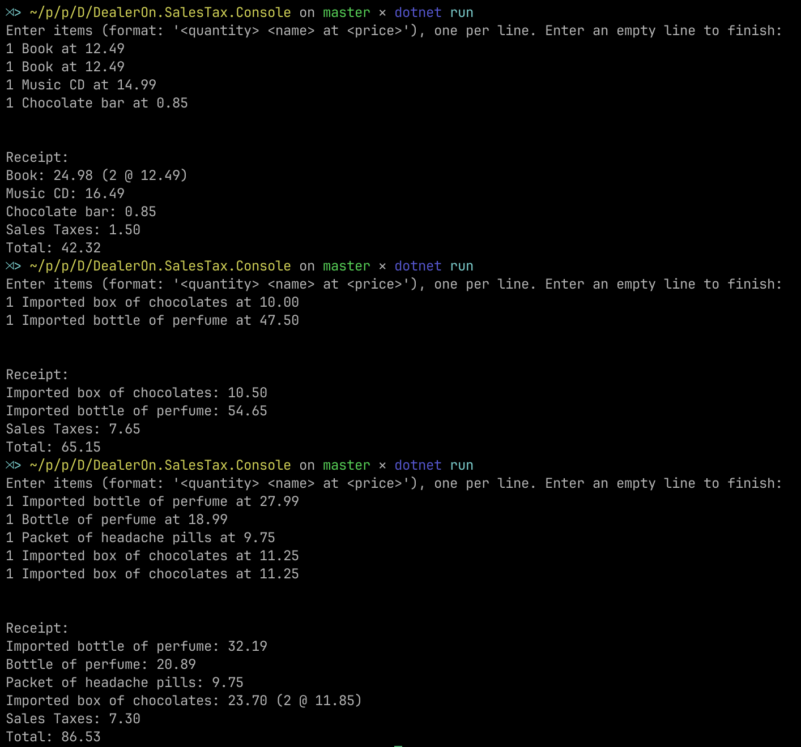
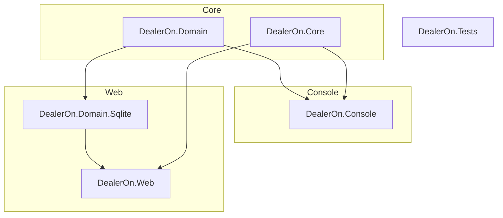

# DealerOn Sales Tax Project

This is my submission for the DealerOn coding test.

The project consists of two front-end components:

1. A simplified **console application** for processing shopping baskets with pre-defined rules as outlined in the test requirements, and
2. A **web application** which does the same thing based on a customizable rule engine stored in a Sqlite database.

## Table of Contents

- [Quick Start](#quick-test)
- [Project Setup](#project-setup)
- [Running the Console Application](#running-the-console-application)
- [Running the Web Application](#running-the-web-application)
- [Using Docker](#using-docker)
  - [Building and Running the Docker Container](#building-and-running-the-docker-container)
- [Configuration](#configuration)

---

## Quick Start

To run the console version:

```bash
dotnet build
cd DealerOn.SalesTax.Console
dotnet run
```

This will start an interactive session into which you can enter your test cases. A blank line will signify completion of input.



---

You can also pipe your input into stdin (note that you would need to provide the `testcase1.txt` file used in the example).

```bash
cd DealerOn.SalesTax.Console
cat testcase1.txt | dotnet run
```

Or on Windows:

```bash
cd DealerOn.SalesTax.Console
type testcase1.txt | dotnet run
```

---

To run the web version:

```bash
dotnet build
cd DealerOn.SalesTax.Web
dotnet run
```

Or using Docker:

```bash
docker build -t dealeron-sales-tax-web .
docker run -p 8080:80 dealeron-sales-tax-web
```

Point your browser at http://localhost:8080 and enjoy!

## Architecture

The project is meant to demonstrate flexibility using a simplified but powerful approach rooted in concepts of functional programming. It is primarily designed to be a demonstration of programming expertise and knowledge of different techniques.

The system is a configurable rule engine which parses items based on user-defined traits (which can be based on keywords, exact text, or regular expressions). A post-processing layer then applies sales & import duties based on the existence of these traits.

There are six projects in total:

Core:

- `DealerOn.Domain`: Core entities
- `DealerOn.Core`: Core business logic
- `DealerOn.Tests`: Unit tests

Console:

- `DealerOn.Console`: Simple console front-end with inline rules defined in `Program.cs

Web:

- `DealerOn.Domain.Sqlite`: Implementation layer for `DealerOn.Domain` that uses a local Sqlite database.
- `DealerOn.Web`: ASP.NET Razor Pages web application which uses database-defined rules.



